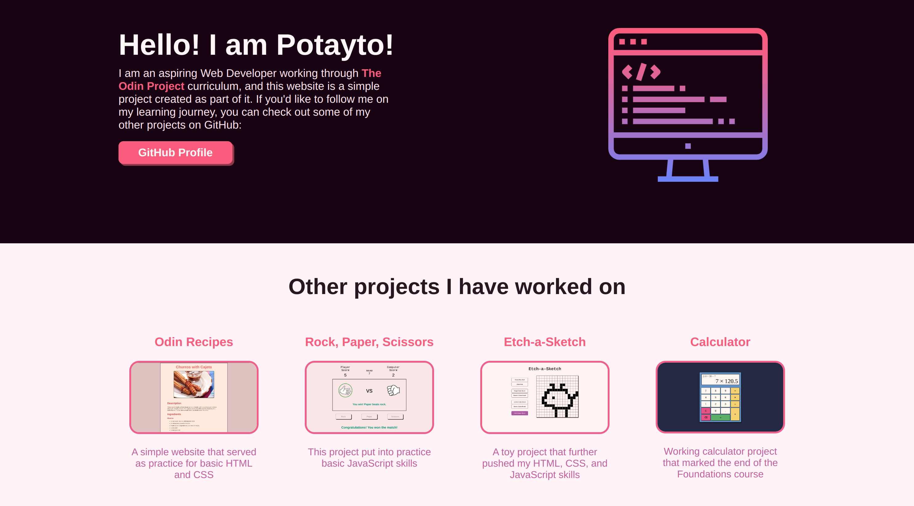

# Project: Landing Page

## Project Preview

 

:link: A **live demo** of this project can be found
[here](https://potaytocheeps.github.io/odin-landing-page/). 

## Description

This is my implementation of the
[Landing Page Project](https://www.theodinproject.com/lessons/foundations-landing-page)
from [**The Odin Project**](https://www.theodinproject.com/) curriculum in the Flexbox
section of the Foundations course.

This is the second project from The Odin Project curriculum and it consists of
putting into practice the flexbox layout module, with all of the different
properties and values associated with it. The project consists of recreating a
landing page from two images provided, one of which shows the completed web page
whose layout we must recreate from scratch, and the other containing extra
information, such as the color and font style information, that will help us achieve
the end result.

## Features

My first iteration working on this project consisted of achieving the same web
page layout that is shown in the curriculum. However, once having completed that,
I changed the content and styles to create more of a simple, personal landing page
for myself, which includes links to my GitHub profile and some of my other projects.

The landing page contains different sections, each one having different layouts
for the content that they display. The different sections consist of the following:

- Header, with inline links to other sections of the web page.
- Hero image section, containing an introduction of myself.
- Data card section, with information on other projects I have worked on.
- Quote section
- Call to action
- Footer

## Concepts Applied

Working on this project, I put into practice many of the different properties of
the flexbox layout module in order to further cement the information that we have
learned so far through the [Flexbox section](https://www.theodinproject.com/paths/foundations/courses/foundations#flexbox)
of the curriculum, such as:

- The vertical and horizontal **alignment** of the flex items within their flex container,
  with the `align-items` and `justify-content` properties.
- The **flex direction** of the container to lay out its flex items, either vertically or horizontally.
- And the size flexibility of both the flex containers and their flex items, by
  making them **grow** and **shrink** in relation to the size of their parent container.

## Reflection

A short blog post containing some of my thoughts on the project can be found
[here](https://potayto.notion.site/Project-Landing-Page-b001583bb54c413ab95d21c2620875f0).
